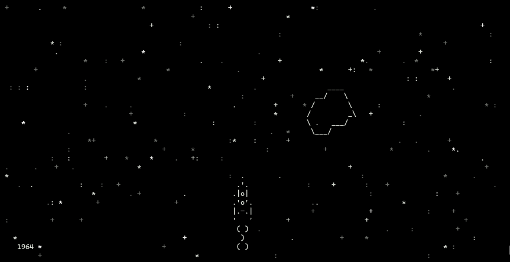
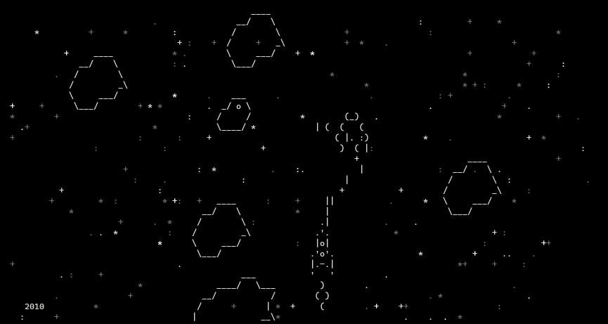
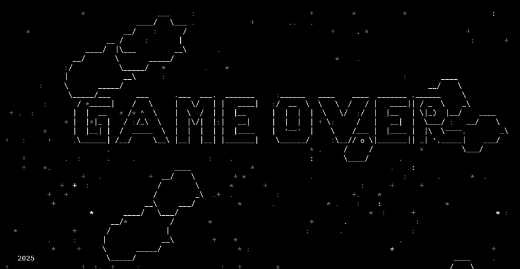

# Игра "Space battle"

Двумерная игра, запускаемая непосредственно в терминале. Игра построена на асинхронных функциях, использован встроенный модуль asyncio. Для отрисовки графики использован встроенный модуль curses.

## Установка и запуск
Для установки игры необходимо скопировать данные репозитория себе на машину. Для этого в терминале необходимо перейти в каталог, в который требуется скопировать данные с игрой, и выполнить команду `git clone https://gitlab.com/stanislav-akolzin/async_spaceship_game`. В каталоге будет создан подкаталог 'async_spaceship_game'. Этот подкаталог будет содержать в себе все необходимые для запуска игры файлы.

Для запуска игры в терминале необходимо перейти в каталог 'async_spaceship_game' и ввести команду `start.py`

## Описание
Игра представляет собой космический шутер - полет на космическом корабле в космосе среди постоянно появляющегося космического мусора. 

В переменной **STAR_SYMBOLS** модуля **globals** указан список символов, которые отображаются в качестве звезд на фоне. При желании можно расширить или сократить этот список.

### Управление  
Движение вверх  - стрелка вверх  
Движение вниз   - стрелка вниз  
Движение вправо - стрелка вправо  
Движение влево  - стрелка влево  
Огонь - пробел

Слева в нижней части окна отображается текущий год. Игра начинается с 1957 года. Сложность игры увеличивается по мере увеличения года. Так, до 1960 г. космос абсолютно чистый. К 2020 г. сложность становится максимальной (много постоянно появляющегося космического мусора), но также в 2020 г. у корябля появляется плазменная пушка, которой можно взрывать этот мусор.

При столкновении с космическим мусором игра заканчивается

